# CalTrack Backend Architecture

## Overview
CalTrack is a nutrition tracking application built with NestJS, TypeScript, and PostgreSQL. The application follows a modular architecture with clear separation of concerns and domain-driven design principles.

## Tech Stack
- **Framework**: NestJS
- **Language**: TypeScript
- **Database**: PostgreSQL
- **ORM**: Prisma
- **Authentication**: JWT + OAuth2 (Google, Facebook)
- **API Documentation**: Swagger/OpenAPI
- **AI Integration**: OpenAI GPT-4o

## Module Tree

```mermaid
graph TD
    A[App Module] --> B[Auth Module]
    A --> C[User Module]
    A --> D[Food Upload Module]
    A --> E[AI Module]
    A --> F[Storage Module]
    A --> G[Nutrition Module]
    A --> H[Prisma Module]
    A --> I[Common Module]

    B --> B1[AuthController]
    B --> B2[AuthService]
    B --> B3[PasswordService]
    B --> B4[RegistrationService]
    B --> B5[JwtStrategy]
    B --> B6[GoogleStrategy]
    B --> B7[FacebookStrategy]

    C --> C1[UserController]
    C --> C2[UserService]

    D --> D1[FoodUploadController]
    D --> D2[FoodUploadService]
    D --> D3[FoodAnalysisDto]

    E --> E1[ChatGptFoodService]
    E --> E2[FoodAnalysisResultDto]

    F --> F1[StorageService]
    F --> F2[LocalStorageProvider]
    F --> F3[IStorageProvider]
    F --> F4[StorageConfig]

    G --> G1[NutritionController]
    G --> G2[NutritionService]
    G --> G3[NutritionReportDto]
    G --> G4[NutritionSummaryDto]

    H --> H1[PrismaService]
    H --> H2[PrismaClient]

    I --> I1[GlobalFilters]
    I --> I2[GlobalInterceptors]
    I --> I3[CommonDTOs]
    I --> I4[CommonInterfaces]

    style A fill:#f9f,stroke:#333,stroke-width:4px
    style B fill:#bbf,stroke:#333,stroke-width:2px
    style C fill:#bbf,stroke:#333,stroke-width:2px
    style D fill:#bbf,stroke:#333,stroke-width:2px
    style E fill:#bbf,stroke:#333,stroke-width:2px
    style F fill:#bbf,stroke:#333,stroke-width:2px
    style G fill:#bbf,stroke:#333,stroke-width:2px
    style H fill:#bbf,stroke:#333,stroke-width:2px
    style I fill:#bbf,stroke:#333,stroke-width:2px
```


## Module Architecture

### Core Modules

#### 1. App Module (`src/app.module.ts`)
- Root module of the application
- Imports all feature modules
- Configures global providers and middleware

#### 2. Auth Module (`src/auth/`)
- Handles user authentication and authorization
- Implements JWT and OAuth2 strategies
- Manages user sessions and tokens
- Components:
  - Controllers: `AuthController`
  - Services: `AuthService`, `PasswordService`, `RegistrationService`
  - Strategies: `JwtStrategy`, `GoogleStrategy`, `FacebookStrategy`

#### 3. User Module (`src/user/`)
- Manages user profiles and settings
- Handles user data and preferences
- Components:
  - Controllers: `UserController`
  - Services: `UserService`
  - DTOs: `UserDto`, `UpdateUserDto`

### Feature Modules

#### 1. Food Upload Module (`src/food-upload/`)
- Handles food image uploads and analysis
- Integrates with AI for food recognition
- Components:
  - Controllers: `FoodUploadController`
  - Services: `FoodUploadService`
  - DTOs: `FoodAnalysisDto`

#### 2. AI Module (`src/ai/`)
- Manages AI integration for food analysis
- Handles communication with OpenAI API
- Components:
  - Services: `ChatGptFoodService`
  - DTOs: `FoodAnalysisResultDto`

#### 3. Storage Module (`src/storage/`)
- Manages file storage operations
- Supports multiple storage providers
- Components:
  - Services: `StorageService`
  - Providers: `LocalStorageProvider`
  - Interfaces: `IStorageProvider`, `StorageConfig`

#### 4. Nutrition Module (`src/nutrition/`)
- Tracks and analyzes nutrition data
- Generates nutrition reports
- Components:
  - Controllers: `NutritionController`
  - Services: `NutritionService`
  - DTOs: `NutritionReportDto`, `NutritionSummaryDto`

### Shared Modules

#### 1. Prisma Module (`src/prisma/`)
- Database connection and management
- Prisma client provider
- Database migrations and seeding

#### 2. Common Module (`src/common/`)
- Shared utilities and helpers
- Global filters and interceptors
- Common DTOs and interfaces

## Data Flow

### Authentication Flow
1. User authenticates via email/password or OAuth
2. JWT token generated and returned
3. Token used for subsequent requests

### Food Upload Flow
1. User uploads food image
2. Image stored temporarily
3. AI analyzes image for food content
4. Results stored in database
5. Response returned to user

### Nutrition Tracking Flow
1. User logs food consumption
2. System calculates nutrition values
3. Data stored in FoodLog and NutritionInfo tables
4. Reports generated on demand

## Database Schema

### Core Models
- User
- Profile
- FoodLog
- NutritionInfo
- Goal
- Connection

### Relationships
- User 1:1 Profile
- User 1:N FoodLog
- FoodLog 1:1 NutritionInfo
- User 1:N Goal
- User N:M Connection

## Security

### Authentication
- JWT-based authentication
- OAuth2 for social login
- Session management
- Token refresh mechanism

### Authorization
- Role-based access control
- Resource ownership validation
- API rate limiting
- Input validation

## API Structure

### Base URL
```
/api/v1
```

### Endpoints
- `/auth/*` - Authentication endpoints
- `/users/*` - User management
- `/food-upload/*` - Food image upload
- `/nutrition/*` - Nutrition tracking
- `/goals/*` - User goals
- `/connections/*` - Social connections

## Error Handling

### Global Error Filter
- Standardized error responses
- HTTP status code mapping
- Error logging

### Validation
- DTO-based validation
- Custom validation pipes
- Error message formatting

## Testing Strategy

### Unit Tests
- Service layer testing
- Controller testing
- Utility function testing

### Integration Tests
- API endpoint testing
- Database integration
- External service mocking

### E2E Tests
- Complete flow testing
- Authentication flows
- Critical user journeys

## Deployment

### Environment Configuration
- Development
- Staging
- Production

### Infrastructure
- Docker containerization
- CI/CD pipeline
- Monitoring and logging

## Future Considerations

### Scalability
- Horizontal scaling
- Database sharding
- Caching strategy

### Features
- Real-time updates
- Advanced analytics
- Mobile app integration

### Performance
- Query optimization
- Response caching
- Asset optimization 