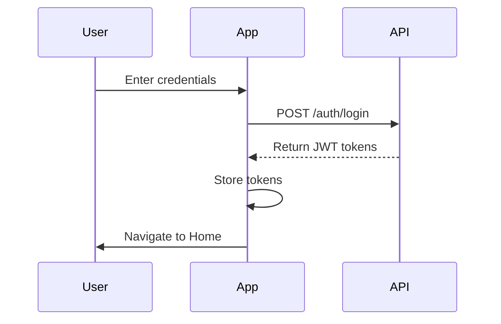
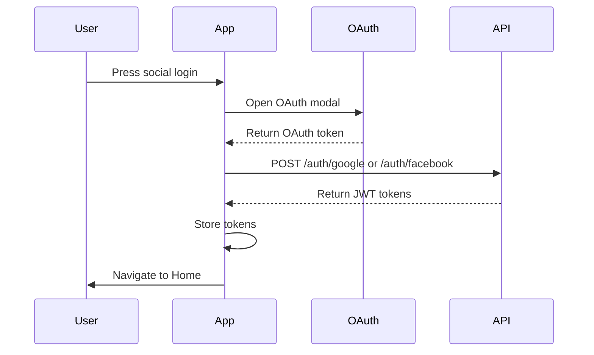

# Authentication Implementation Guide for React Native

This guide explains how to implement authentication in your React Native application using our NestJS backend authentication system.

## Table of Contents
- [Setup](#setup)
- [Authentication Flow](#authentication-flow)
- [Implementation Steps](#implementation-steps)
- [API Endpoints](#api-endpoints)
- [Code Examples](#code-examples)
- [Error Handling](#error-handling)
- [Best Practices](#best-practices)

## Setup

### Dependencies
Add these dependencies to your React Native project:

```bash
npm install @react-native-async-storage/async-storage
npm install @react-navigation/native
npm install @react-navigation/stack
npm install axios
npm install react-native-keychain
```

### Environment Configuration
Create a `.env` file in your React Native project root:

```env
API_URL=http://your-api-url
GOOGLE_WEB_CLIENT_ID=your-google-web-client-id
FACEBOOK_APP_ID=your-facebook-app-id
```

## Authentication Flow

### 1. Email/Password Authentication


### 2. Social Authentication


## Implementation Steps

### 1. Setup Authentication Context

```typescript
// src/contexts/AuthContext.tsx
import React, { createContext, useState, useContext } from 'react';
import AsyncStorage from '@react-native-async-storage/async-storage';

interface AuthContextData {
  user: User | null;
  loading: boolean;
  signIn: (credentials: SignInCredentials) => Promise<void>;
  signOut: () => Promise<void>;
  // ... other methods
}

export const AuthContext = createContext<AuthContextData>({} as AuthContextData);

export function AuthProvider({ children }: { children: React.ReactNode }) {
  const [user, setUser] = useState<User | null>(null);
  const [loading, setLoading] = useState(true);

  // Implementation methods here...

  return (
    <AuthContext.Provider value={{ user, loading, signIn, signOut }}>
      {children}
    </AuthContext.Provider>
  );
}
```

### 2. Setup API Client

```typescript
// src/services/api.ts
import axios from 'axios';
import AsyncStorage from '@react-native-async-storage/async-storage';

const api = axios.create({
  baseURL: process.env.API_URL,
});

api.interceptors.request.use(async (config) => {
  const token = await AsyncStorage.getItem('@Auth:token');
  
  if (token) {
    config.headers.Authorization = `Bearer ${token}`;
  }
  
  return config;
});

export default api;
```

### 3. Implement Authentication Methods

```typescript
// src/services/auth.ts
import api from './api';
import AsyncStorage from '@react-native-async-storage/async-storage';

export async function signIn(email: string, password: string) {
  const response = await api.post('/auth/login', { email, password });
  const { accessToken, refreshToken } = response.data;
  
  await AsyncStorage.setItem('@Auth:token', accessToken);
  await AsyncStorage.setItem('@Auth:refreshToken', refreshToken);
  
  return response.data;
}

export async function signInWithGoogle(token: string) {
  const response = await api.post('/auth/google', { token });
  // ... handle tokens
}

export async function signInWithFacebook(token: string) {
  const response = await api.post('/auth/facebook', { token });
  // ... handle tokens
}
```

## API Endpoints

### Authentication Endpoints

| Endpoint | Method | Description | Request Body | Response |
|----------|--------|-------------|--------------|-----------|
| `/auth/register` | POST | Register new user | `{ email, password, name }` | User object |
| `/auth/login` | POST | Email/password login | `{ email, password }` | JWT tokens |
| `/auth/google` | GET | Google OAuth login | - | Redirect |
| `/auth/facebook` | GET | Facebook OAuth login | - | Redirect |
| `/auth/me` | GET | Get current user | - | User object |
| `/auth/logout` | POST | Logout user | - | Success message |

## Code Examples

### Login Screen Example

```typescript
// src/screens/Login.tsx
import React, { useState } from 'react';
import { View, TextInput, Button } from 'react-native';
import { useAuth } from '../contexts/AuthContext';

export function LoginScreen() {
  const [email, setEmail] = useState('');
  const [password, setPassword] = useState('');
  const { signIn } = useAuth();

  async function handleLogin() {
    try {
      await signIn({ email, password });
    } catch (error) {
      // Handle error
    }
  }

  return (
    <View>
      <TextInput
        placeholder="Email"
        value={email}
        onChangeText={setEmail}
      />
      <TextInput
        placeholder="Password"
        value={password}
        onChangeText={setPassword}
        secureTextEntry
      />
      <Button title="Login" onPress={handleLogin} />
    </View>
  );
}
```

## Error Handling

### Common Error Scenarios

1. Invalid Credentials
```typescript
try {
  await signIn(credentials);
} catch (error) {
  if (error.response?.status === 401) {
    Alert.alert('Error', 'Invalid email or password');
  }
}
```

2. Network Errors
```typescript
try {
  await signIn(credentials);
} catch (error) {
  if (!error.response) {
    Alert.alert('Error', 'Network error. Please check your connection.');
  }
}
```

3. Token Expiration
```typescript
api.interceptors.response.use(
  (response) => response,
  async (error) => {
    if (error.response?.status === 401) {
      // Attempt to refresh token
      try {
        const newToken = await refreshToken();
        error.config.headers.Authorization = `Bearer ${newToken}`;
        return api.request(error.config);
      } catch (refreshError) {
        // Token refresh failed, logout user
        await signOut();
      }
    }
    return Promise.reject(error);
  }
);
```

## Best Practices

1. **Secure Token Storage**
   - Use `react-native-keychain` for storing sensitive data
   - Never store tokens in plain AsyncStorage on production

2. **Token Management**
   - Implement token refresh mechanism
   - Clear tokens on logout
   - Handle token expiration gracefully

3. **Error Handling**
   - Provide clear error messages to users
   - Implement proper error boundaries
   - Log errors for debugging

4. **Social Authentication**
   - Handle OAuth flow in WebView
   - Implement deep linking for OAuth callbacks
   - Handle OAuth errors gracefully

5. **Testing**
   - Test authentication flows
   - Mock API calls in tests
   - Test error scenarios

6. **Security**
   - Implement biometric authentication when available
   - Add rate limiting for login attempts
   - Implement proper session management

7. **UX Considerations**
   - Show loading states during authentication
   - Provide feedback for user actions
   - Implement proper navigation after authentication

## Troubleshooting

### Common Issues and Solutions

1. **OAuth Popup Blocked**
   - Use in-app browser for OAuth
   - Handle OAuth flow within the app

2. **Token Refresh Fails**
   - Implement exponential backoff
   - Fallback to login screen

3. **Deep Linking Issues**
   - Verify URL schemes
   - Test on both platforms

For more detailed information about the backend API, refer to the [API Documentation](/api-docs). 